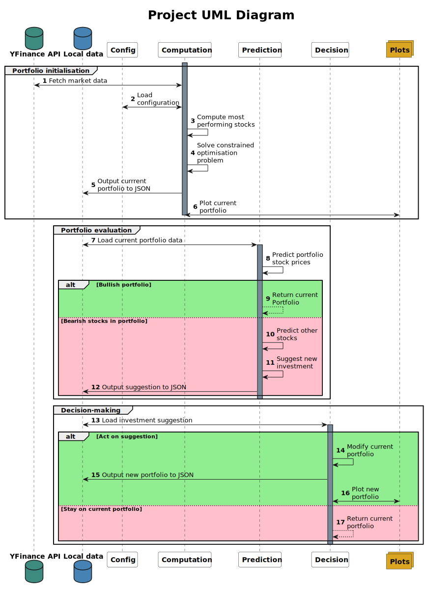

# Project : Machine Learning module for portfolio profitability prediction and trading recommendation
Romain MRAD - Yoan Hakoun 

[Sequence Diagram](#sequence-diagram)

## Introduction

This machine learning module lets you manage a 100 000€ portfolio
of equities and recommends the best action to do on a daily basis, based on 
chartist profitability prediction.

## Sequence Diagram


## Directory Structure

```
UVProjet/
├── config/
│   ├── market_config.json
│   └── portfolio_config.json
├── data/
│   └── portfolio
├── docs/
│   └── sequence_diagram/
│       ├── sequence.puml
│       └── sequence.svg
├── graphs/
├── src/
│   ├── portfolio_initialisation.py
│   ├── portfolio_evaluation.py
│   ├── grapher.py
│   └── parameters.py
├── README.md
├── requirements.txt
└── .gitignore
```
